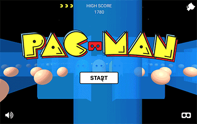

# Pacman WebVR

Pacman VR experience using web framework [A-Frame](https://aframe.io/)

## Live Demo

https://shaqian.github.io/pacman/



## Run the App

### Install Dependencies

```
npm install
```

### Preparation

To make player move in the direction of the camera, we need to do a little hack with aframe-extras.

Go to `node_modules/aframe-extras/src/pathfinding/nav-agent.js`. Make two changes:

1. Near line 5-6
```javascript
  schema: {
    destination: {type: 'vec3'},
    active: {default: false},
    speed: {default: 2},
    lookAtTarget: {default: true} // add this line
  },
```

2. Near line 83-84
```javascript
      if (data.lookAtTarget) // add this line
        el.object3D.lookAt(gazeTarget);
```

### Build for development

```
npm start
```

### Build for production

```
npm run build
```

## Caveat

Device rotation works on iOS devices but may not work on some Android devices because of [issues](https://github.com/aframevr/aframe/issues/3550) with Chrome.

In non-VR mode you can still swipe screen to move the player.